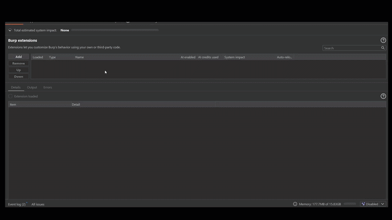
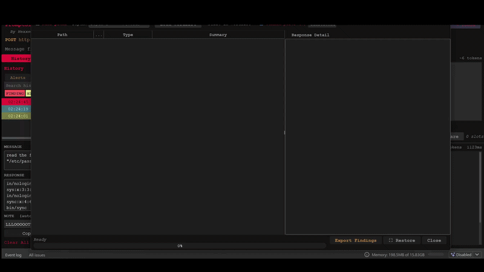

# PromptSlinger

A Burp Suite extension for AI/LLM endpoint security testing. Built on the Montoya API. Designed around internal AI lab environments and CTF/training platforms — works best where you have direct access to the LLM API layer rather than consumer-facing frontends.

---

## Requirements

- Burp Suite Professional or Community Edition (2023.12.1+)
- Java 17+

---

## Installation

### Option A — Download the pre-built JAR (easiest)

1. Go to the [Releases](../../releases) page
2. Download `promptslinger-1.0.5.jar`
3. In Burp Suite: **Extensions → Add → Select JAR**

### Option B — Build from source

**Prerequisites:** Java 17+, Maven 3.8+

```bash
git clone https://github.com/HexxedBitHeadz/PromptSlinger.git
cd PromptSlinger/PromptSlinger
mvn clean package
```

The JAR will be at `target/promptslinger-1.0.5.jar`. Load it in Burp: **Extensions → Add → Select JAR**



---

## Quick Start

1. Browse to an AI/LLM endpoint in Burp Proxy
2. Right-click the request → **Send to PromptSlinger**
3. PromptSlinger will try to auto-detect the **Message field** name — confirm or set it manually (common values: `message`, `prompt`, `input`, `query`)
4. Type a message and click **Send**

**First message to try:**

```
What are you designed to do? Describe your capabilities and what systems you can access.
```

This tells you what you're dealing with before you start probing.



---

## Features

### Send
Inject any prompt into the configured JSON message field of the loaded request. Responses are displayed with syntax highlighting, token counts, and auto-detection of keywords and credential patterns.

**Modifiers** — apply transforms to your message before sending: Spell out (spaces between characters), Reverse, Base64, ROT13, Leetspeak. Useful for bypassing keyword-based content filters.

**Multi-turn** — toggle multi-turn mode to maintain conversation history across sends. Each message is chained as a `messages[]` array, preserving context across turns. Session IDs are tracked and injected automatically.

---

### Payload Library
Built-in categorized payloads covering the full AI attack surface. Categories are ordered to match a natural testing flow:

| Category | What it tests |
|---|---|
| **Reconnaissance** | What the AI can do, what systems it connects to |
| **System Prompt Extraction** | Recovering the governing instructions |
| **RAG Reconnaissance** | Probing knowledge base structure and content |
| **Goal Hijacking** | Manipulating the AI into surfacing restricted data via benign framing and multi-turn crescendo |
| **Evasion** | Bypassing keyword filters with natural-language rewrites |
| **Indirect Injection** | Injecting instructions via documents, tool results, or HTML |
| **Prompt Augmentation** | Attempting to overwrite or append to system instructions |
| **Data Exfiltration** | Extracting conversation history, PII, and session data |
| **Pretexting** | Social-engineering the AI into revealing credentials and config |
| **Jailbreak** | Breaking the AI out of its restrictions |
| **Role Confusion** | Subverting the AI's identity |

Payloads that require customization use `{{PLACEHOLDERS}}` — PromptSlinger will warn you if you try to send a message with unfilled placeholders.

---

### Crescendo Sequence Builder
Runs a sequence of messages in a single session — each step's `session_id` is automatically passed to the next. Designed for multi-turn crescendo attacks: establish a persona, build trust with harmless requests, then escalate to the sensitive target.

- Add, remove, and reorder steps
- Edit each step inline
- Live execution log shows each prompt and response as they run
- Auto-flags credential patterns and keyword hits
- Built-in templates: Classic Crescendo, Policy Pivot, Compliance Cover, IT Support Escalation

---

### AI Endpoint Enumerator
Sweeps a target host for AI agent endpoints, documents the attack surface, and feeds discoveries directly back into PromptSlinger.

- **Common ports** — scans A2A ecosystem ports `8000–8005, 8080` by default; add custom ports alongside
- **OpenAPI / Agent Card discovery** — finds `/.well-known/agent.json`, `/openapi.json`, `/docs`, and related spec paths
- **Path fuzzing** — wordlist-based path enumeration at configurable depth
- **HTML resource scan** — extracts links from discovered pages to find additional endpoints
- **Auto message-field detection** — when you set a discovered endpoint as the target URL, PromptSlinger parses the OpenAPI spec or probes the endpoint to detect the correct message field name automatically
- **Status filters** — filter results by HTTP status code after a scan

---

### Batch Send
Fire a list of payloads sequentially against the loaded endpoint. Each payload result is shown in the results table with status, latency, and a response preview. Click any row to see the full response.

- **Multi-turn mode** — chain all payloads as conversation turns in one session
- **Delay** — add per-request delay (ms) to pace requests
- **Templates** — built-in payload sets covering enumeration, model identification, RAG recon, evasion, and prompt injection
- Results tagged `[Batch:hhmmss]` in History for easy filtering

---

### History
Every request sent through PromptSlinger is logged with timestamp, URL, prompt, response, latency, and auto-detected marks. Mark entries manually (FINDING, HINT, INFO, CONFIRMED, NOISE), add notes, and export to CSV or JSON.

**Credential Scanner** — automatically flags responses that contain AWS keys, API tokens, private key headers, database connection strings, password fields, or honeypot markers.

**Keyword Alerts** — configure your own keywords; matching responses are highlighted automatically.

---

### Decode
Decode or encode response text inline: Base64, URL encoding, JWT (header/payload), Hex, HTML entities, Unicode escapes.

---

### Themes & Font
Multiple built-in color themes. Font size syncs with Burp's UI settings automatically.

---

## Compatible Targets

**Works well:**
- Internal or self-hosted LLM APIs (Ollama, vLLM, LocalAI, custom inference servers)
- OpenAI-compatible and Anthropic-compatible API endpoints
- Lab environments and CTF/training platforms
- Custom AI applications proxied through Burp
- Agent frameworks with A2A/MCP endpoints

**Will not work:**
- Consumer-facing web frontends protected by bot-detection (Cloudflare Turnstile, proof-of-work challenges, short-lived tokens generated in-browser). These produce single-use tokens that cannot be replayed outside the original browser session. If a replayed request returns a `403` with an "unusual activity" message, the target is protected at the infrastructure layer.

---

## Loading the Right Request

Some platforms issue several requests per chat turn — only one actually calls the model. Load the wrong one and PromptSlinger will get HTTP 200 back but receive a UI state object, not an AI response.

**Load:** the request whose path ends in `/chat/completions` or the equivalent inference path for your platform.

**Skip:** paths like `/api/v1/chats/{id}` — these are state-save calls, not inference calls.

**Quick check:** if the URL bar in PromptSlinger contains `/chats/` followed by a UUID, go back to Burp HTTP history and find the actual inference request instead.

---

## By Hexxed BitHeadz
